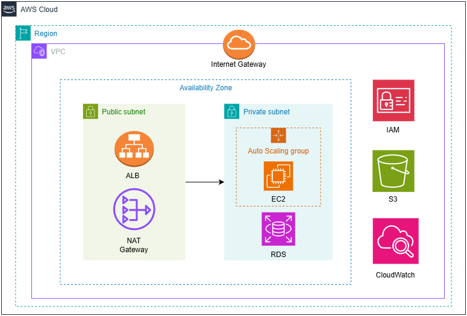

# Scenario 1: Two-Tier Web Application

A small startup wants to deploy a simple web application on AWS with the following requirements:

## Requirements

- **Backend application** should run in a secure AWS compute environment  
- **Frontend** must be publicly accessible  
- Supports **small traffic (~5K users/day)**  
- **Cost must be low** (downtime acceptable)  
- **Managed database service** (no DB on EC2)  
- **Basic monitoring and logging**  
- Deployed in a **single Availability Zone**

## Proposed Solution Architecture Diagram

## Explaination

- **Application Load Balancer (ALB)** - Routes users request to compute server
- **NAT Gateway** - Allows an internet access to EC2 instance in private subnet
- **EC2** - Hosts backend of an web application
- **Amazon RDS** - Managed relational database for storing data
- **IAM** - Provides roles and permission access for EC2, S3 and RDS
- **Amazon S3** - Hosts frontend of a web application. Also low cost service
- **CloudWatch** - A monitoring tool to store logs and trigger alarms

***Note:*** *RDS and EC2 are placed in private subnets so that users cannot directly access the backend servers or the database.*

